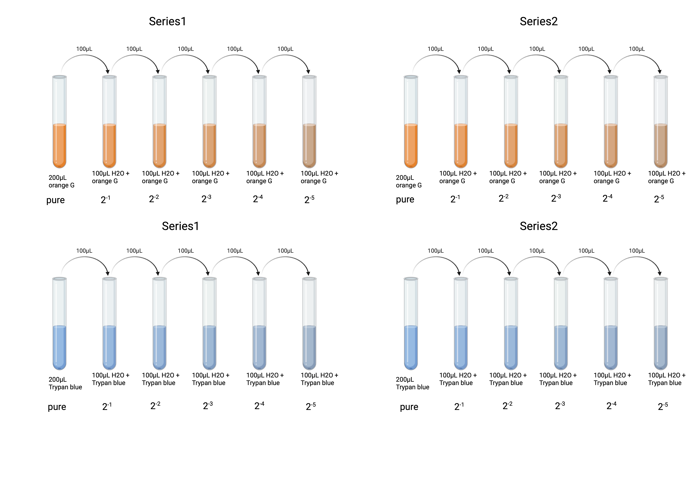
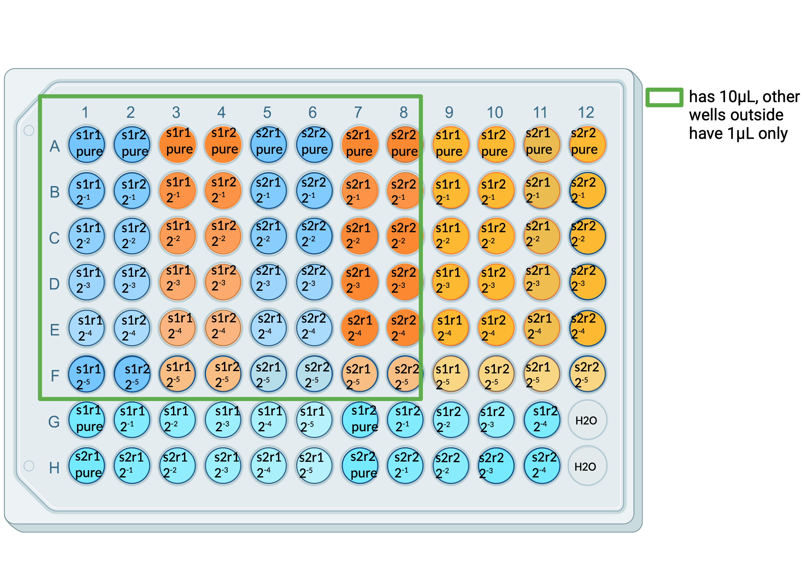

# Load required packages:
Need to install `pacman` package first, if not installed already. Use `install.packages("pacman")` to install the package. The best thing about this package is it will install any package listed inside the `p_load()` function and load it all by itself. So, it does the works of both `install.packages()` and `library()` functions. Find more about what it can do in this documentation: https://www.rdocumentation.org/packages/pacman/versions/0.5.1.
```{r}
# Load the pacman package to manage other packages
if (!requireNamespace("pacman", quietly = TRUE)) {
  install.packages("pacman")
}
library(pacman)

# (install, if required &) load packages

pacman::p_load(
  conflicted,
  desplot,
  emmeans,
  ggtext,
  MetBrewer,
  multcomp,
  multcompView,
  tidyverse, 
  readxl,
  see,
  performance, 
  scales, 
  ggpubr, 
  rstatix)

# handle function conflicts
conflict_prefer("filter", "dplyr") 
conflict_prefer("select", "dplyr")
```
# Experimental Design:  

Now we are going to load the dataset we need for the analysis. Information on the experimental design is required to understand the dataset.  
It was a simple dilution series experiment to check pipetting/handling error. We used 2 colors, namely, trypan blue and orange G.   
- At first, we made 2 tubes with 200 µL of trypan blue and 2 tubes with 200 µL of orange G. We made 2 tubes per color to see if initial 200 µL was making any difference.    
- Then we took 100 µL color from the first vial and added it in the next new tube having 100 µL of water. So, it is the $2^{-1}$ dilution. Then we took 100 µL color from the $2^{-1}$ dilution tube and added to the next one. This process was followed till getting $2^{-5}$ dilution. So, we have 2 dilution series per color and it is named as `Series` in the dataset. 1 is for the first series, and 2 is for the second series. See picture below.    

```{r, echo=FALSE, fig.cap="Dilution Series making"}

```
- Then we were ready to pipette the colors as our experimental design (see the picture below). At first, we added 49 µL of water in each well. Also, we made technical replicates of each series. For example, `s1r1`, `s1r2` means repeat `1` and `2` from the same series `1` and `s2r1`, `s2r2` means repeat `1` and `2` from the same series `2` (in the data file, `repeat` is named as `rpt`). The same structure is followed for both of the colors, except the last 2 wells in the last (12th) column. Those 2 wells have only water (`49 + 1 = 50 µL`). Then we measured the optical density of the whole plate.    


```{r, echo=FALSE, fig.cap="Dilution Series making"}

```
# Read/load the dataset:
While reading, we added a new column named `finalconc` having final concentration of the colors. We simply multiplied `volume` with `conc` and divided the product by the summation of `49 + volume`.
```{r}
dat <- read_xlsx ("2color_OD.xlsx", sheet = 1) %>% 
  mutate(Series = as_factor(Series),
         rpt = as_factor(rpt),
         Color = as_factor(Color), 
         Amount = volume*conc, 
         finalconc = (volume*conc)/(49+volume))
```

# Liner regression (model) for the two colors
```{r}
mod_orange <- dat %>% 
  filter(Color == "orange G") %>% 
  lm (OD492 ~ (finalconc), 
      data = .)
summary(mod_orange)

mod_blue <- dat %>% 
  filter(Color == "trypan blue") %>% 
  lm (OD492 ~ (finalconc), 
      data = .)
summary(mod_blue)
```
# If we want to plot the residuals:  
```{r}
plot(mod_orange$residuals)
plot(mod_blue$residuals)

colors <- c("blue", "orange", "lightblue") %>% 
  as.vector() %>%  
  set_names(levels(dat$Color))
```
What do you see from the residuals?  

# Now, plot the models
```{r}
g <- dat %>% 
  ggplot(aes(
    x = finalconc,
    y = OD492, 
    color = Color,
    #shape = factor(rpt), 
    alpha = 0.8))+
  geom_point(size = 3) +
  theme_bw()+
  color_palette(colors)

g + geom_line(data = fortify(mod_blue), aes(x = finalconc, y = .fitted, color = "blue"))+
  geom_line(data = fortify(mod_orange), aes(x = finalconc, y = .fitted, color = "orange"))
```

But the color of the points are not evealing much about the `repeat` or `series` information. Let's try to do that!  

# Plot according to technical replicate (repeat) information:  
To see if the technical repeats are similar. Dissimilarities here means problem in pipetting.
```{r}
# Extract predicted values and merge with 'dat'
modo_df <- dat %>% 
  filter(Color == "orange G") %>% 
  mutate(predicted = predict(mod_orange))

modb_df <- dat %>% 
  filter(Color == "trypan blue") %>% 
  mutate(predicted = predict(mod_blue))

# Plot
g <- dat %>% 
  ggplot(aes(
    x = finalconc,
    y = OD492, 
    color = Color,
    shape = rpt,  # Shape points based on the 'rpt' column
    alpha = 0.8)) +
  #geom_point(size = 3, position = position_jitter(width = 0.1, height = 0.2)) +
  geom_point(size = 3) +
  theme_bw() +
  color_palette(colors)

# Add lines for the models
g + 
  geom_line(data = modb_df, aes(x = finalconc, y = predicted, color = "blue")) +
  geom_line(data = modo_df, aes(x = finalconc, y = predicted, color = "orange"))
```
What does the picture say about pipetting?

# Plot according to `Series` information:  
But if `Series` are a bit diferent that means it was different at the very beginning when we made the so called `pure` stocks. 
```{r}
# Extract predicted values and merge with 'dat'
modo_df <- dat %>% 
  filter(Color == "orange G") %>% 
  mutate(predicted = predict(mod_orange))

modb_df <- dat %>% 
  filter(Color == "trypan blue") %>% 
  mutate(predicted = predict(mod_blue))

# Plot
g <- dat %>% 
  ggplot(aes(
    x = finalconc,
    y = OD492, 
    color = Color,
    shape = Series,  # Shape points based on the 'rpt' column
    alpha = 0.8)) +
  geom_point(size = 3) +
  theme_bw() +
  color_palette(colors)

# Add lines for the models
g + 
  geom_line(data = modb_df, aes(x = finalconc, y = predicted, color = "blue")) +
  geom_line(data = modo_df, aes(x = finalconc, y = predicted, color = "orange"))
```
So, what would you say about the handling/pipetting seeing all these infrmation? Try to interpret the pictures. 
Stay tuned!
